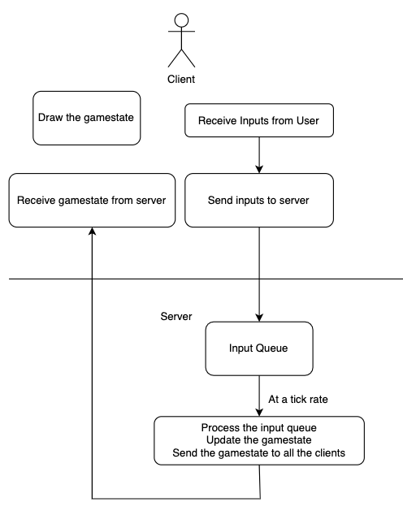

# Implementing an Real Time Strategy (RTS) game in Go
There isn't a lot out there for creating games in Go. There also isn't a lot out there for handling network programing for multiplayer games in go. I've been doing a lot of game development in Go, and I'd like to share how I've been implementing an RTS game using [ebiten](https://ebiten.org/) and websockets.

## Networking Overview
I think its important to start with the networking aspect of any multiplayer game. In my experience, it is easier to implement multiplayer first than to add it to an existing game. If you implement it later, you may run into issues refactoring major parts of your game logic, mainly around handling the gamestate.

Here's an overview of how my initial client-server networking model works:

1. Once per frame, all player clients send their game inputs to the server.
2. On one server thread per client, put the inputs on an input queue.
3. In a single server thread that executes at a specific rate:  
    1. Process the input queue.
    2. Update the gamestate.
    3. Send the gamestate to all the players
4. In a client thread, all players receive the gamestate.
5. In another thread, continually draw the gamestate.



Because the server is the authority on the game state, the client is "dumb" and simple. The client just sends inputs and draws the screen.

One problem of this simple approach is that there is latency between the player's inputs and when the results are drawn on screen. However, because this is an RTS, you don't really "control" your character, you make orders for your units to follow. Latency is not as important here as compared to a platformer or a first person shooter.

### Sending data
How should the client communicate with the server and vice versa? You basically have to make a decision between TCP and UDP. TCP has a lot of overhead for a variety of reasons, such as guaranteed delivery and resending of packets. However, our data is time sensitive. Why resend gamestate that is already too old to use? UDP is much faster. However, UDP is connectionless and does not guarantee delivery of a packet. So even if you go for UDP, it is up to the application to implement guaranteed delivery of packets. See [here](https://gafferongames.com/post/udp_vs_tcp/) for a more indepth discussion.

Also, no matter which transport protocol you choose, using `recv` directly requires you to write your own application messaging protocol, usually by reserving the first couple bytes of data for the message payload size, and then reading that number of bytes from the socket.

Well, there is the option of using a higher level interface for networking to deal with those sorts of issues. WebSockets uses TCP, and WebRTC uses UDP. These technologies take care of a lot of these lower level issues for you. !!!LINKS ON EACH!!!

In the end, I ended up going with WebSockets using [nhooyr/websocket](https://github.com/nhooyr/websocket) for the following reasons:

1. KISS (Keep It Simple, Stupid). nhooyr's websocket library is ridiculously easy and simple to use.
2. I don't have to deal with lower level TCP/UDP socket issues.
3. I haven't had any perceivable latency issues using websockets.
4. The library works with Web Assembly. Easy way to run the game in the browser.

If I run into any issues regarding latency, I'll consider a switch to WebRTC, and if that doesn't work out, to UDP.

It's pretty simple to send and receive payloads with websockets. Here's my generic message sending and receiving code:
```golang
package network

import (
	"context"
	"encoding/json"
	"errors"

	"nhooyr.io/websocket"
)

type MessageType int

const (
    Inputs MessageType = iota
    Gamestate
)

type Message struct {
	Type    MessageType
	Payload []byte
}

func Read(ws *websocket.Conn) (Message, error) {
	_, payload, err := ws.Read(context.Background())
	if err != nil {
		return Message{}, err
	}
	var msg Message
	err = json.Unmarshal(payload, &msg)
	return msg, err
}


func Write(ws *websocket.Conn, msg Message) error {
	payload, _ := json.Marshal(msg)
	return ws.Write(context.Background(), websocket.MessageText, payload)
}
```

Eventually, I will also integrate compression and decompression into these functions.

Notice the `Payload` is of type `[]byte`. This way, I can store anything in a `Message`, and then when reading, I can use the `Type` to know how to read it. Normally, it's just json marshalled.

### Client
Of course, you'll need a game library in order to render your game on the screen. I use [ebiten](https://ebiten.org). I've worked with other go game development libraries, and I have found this one to be the simplest yet very powerful. The website has enough documentation and examples to get you started. For the TLDR, you need to implement both `Update` and `Draw` functions. `Update` usually happens 60 times a second, while `Draw` usually happens at the refresh rate of your screen.

You essentially need 3 concourrent code paths: drawing, sending inputs, and reading the gamestate from the server. Go has multiple ways of dealing with concurrency issues, such as channels and locks. Here, we can use `sync.Map` for all of the objects in our gamestate.

Drawing then becomes easy: just read from the map and draw it. For example purposes, I left out some things, such as drawing the objects in a specific order.

```golang
package main

type Game struct{
	actors sync.Map
	ws *websocket.Conn
}

func (g *Game) Draw(screen *ebiten.Image) {
    	g.actors.Range(func(key, value interface{}) bool {
		actor := value.(Actor)
		op := &ebiten.DrawImageOptions{}
		op.GeoM.Translate(actor.X, actor.Y)
		screen.DrawImage(actor.Image, op)
		return true
	})
}
```

In `Update`, read the inputs and send them to the server. Again, simplified.

```golang
type Button int
const (
	Skill1 Button = iota
)
func (g *Game) Update() error {
	buttons := []Button{}
	if inpututil.IsKeyJustPressed(ebiten.KeyQ) {
		inputs = append(buttons, Skill1)
	}
	payload, _ := json.Marshal(buttons)
	msg := network.Message{
		Type: network.Inputs,
		Payload: payload,
	}
	network.Send(g.ws, msg) // TODO handle error
	return nil
}
```

And finally, reading from the server. You'll need to spin off a go routine for this.

```golang
func (g *Game) readFromServer() {
	for {
		msg, _ := network.Read(g.ws) // TODO handle error
		switch msg.Type {
		case network.Gamestate:
			var gamestate map[string]Actor
			json.Unmarshal(msg.Payload, &gamestate) // TODO error
			for id, actor := range gamestate {
				g.actors.Store(id, actor)
			}
			
		}
	}
}
```
		
### Server

Before writing your server code, you need to decide between including the server code within your client code distributable or to keep the server code separate. I include the server code in the same executable, because I wanted to give the option for users to run their own servers. You then simply provide an environment variable or command line switch to specify that you are running in server mode instead of client mode. I chose not to include this option in the UI, so I could easily host my executable in the cloud, without starting the graphics options required for ebiten.

Since we are running websockets, you just need to start an http server and then upgrade the connection to a websocket. I also include spinning off a go routine for handling the gamestate.

```golang
package server

... 

type Handler struct {
}

func Run() error {
	port := os.Getenv("PORT")
	if port == "" {
		return errors.New("no port provided") 
	}
	l, err := net.Listen("tcp", ":"+port)
	if err != nil {
		return err
	}

	hndlr := Handler{}

	s := &http.Server{
		Handler:      hndlr,
		ReadTimeout:  time.Second * 10,
		WriteTimeout: time.Second * 10,
	}
	
	go updateGamestate()

	return s.Serve(l)
}

func (h Handler) ServeHTTP(w http.ResponseWriter, r *http.Request) {
	c, err := websocket.Accept(w, r, &WebSocketOptions)
	if err != nil {
		log.Printf(err.Error())
		// write an http response to make healtcheck requests happy
		w.Write([]byte("ok"))
		return
	}
	defer c.Close(websocket.StatusInternalError, "")
...
```

Once you've established a websocket connection, you can use your `sync.Map` to store the websockets as well as the players.

```golang
	// ServeHTTP, continued
	...
	id := uuid.NewString()
	websockets.Store(id, c)
	actors.Store(id, &actor.Actor{})
	...
```

Notice I'm using the same actor type here. It makes it easier to handle send the network messages as JSON. Since they are the same type, json marshal/unmarshal just works.

Now we can continually handle input message from the client.

```golang
...
	for {
		msg, err := network.Read(c)
		if err != nil {
			log.Printf(err.Error())
			actors.Delete(id)
			webSockets.Delete(id)
			return
		}
		switch msg.Type {
		case "Inputs":
			var inputs input.Inputs
			err := json.Unmarshal(msg.Payload, &inputs)
			if err != nil {
				log.Printf(err.Error())
				actors.Delete(id)
				webSockets.Delete(id)
				return
			}
			inputChannel <- playerInput{
				id:     id,
				inputs: inputs,
			}

		}
	}
```
	
What's that `inputChannel`? Well, we need some sort of communcation between our routines to get the inputs from all the players to the same place for processing. We will read from the channel in `updateGamestate()`

`updateGamestate()` works by looping by using `select` over two channels, `inputQueue` and a `ticker.C`. On an `inputQueue` message, we append the inputs to a slice. In our `ticker`, we process all of the inputs in the slice, process the game state, and then send it to all the players. The parameter to `time.NewTicker` is the tick rate of how often to process the game and send it to the player. I chose 30 times per second, as this is used by one of the most popular RTS (technically a MOBA) games today, Dota 2.

```golang
func updateGamestate() {
	inputSlice := []playerInput{}
	ticker := time.NewTicker(time.Second / 30)
	for {
		select {
		case inputs := <-inputQueue:
			inputSlice = append(inputSlice, inputs)
		case <-ticker.C:
			// update the inputs for all players
			for _, i := range inputSlice {
				value, ok := actors.Load(i.id)
				if !ok {
					continue
				}
				p := value.(*actor.Actor)
				p.UpdateInputs(i.inputs)
			}
			inputSlice = []playerInput{}

			// calculate the new game state
			actorPayload := map[string]actor.Actor{}
			actors.Range(func(key, value interface{}) bool {
				p := value.(*actor.Actor)
				p.Update()
				actorPayload[key.(string)] = *p
				return true
			})

			// send the payload to all players
			payload, err := json.Marshal(actorPayload)
			if err != nil {
				log.Print("json marshal error:", err)
				continue
			}
			webSockets.Range(func(key, value interface{}) bool {
				conn := value.(*websocket.Conn)
				err := network.Write(conn, network.Message{
					Type:    "Gamestate",
					Payload: payload,
				})
				if err != nil {
					log.Printf(err.Error())
					webSockets.Delete(key)
				}
				return true
			})
		}
	}
}
```

And thats the basics! I left out some discussions that I may or may not cover in a future post:
* Handling drawing and animations locally
* Client side interpolation
* Executing game logic and drawing in a fixed order
* Projectiles, enemies, and other non player objects

I hope this is helpful.
